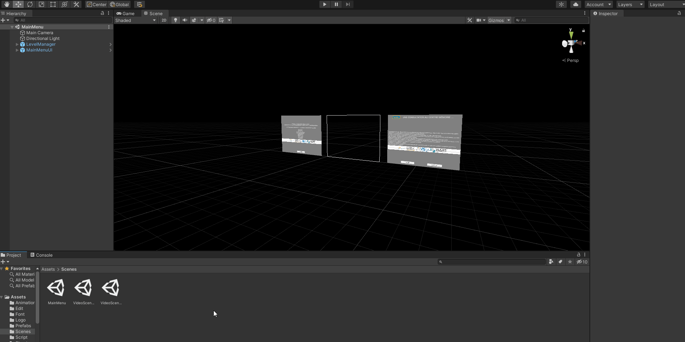
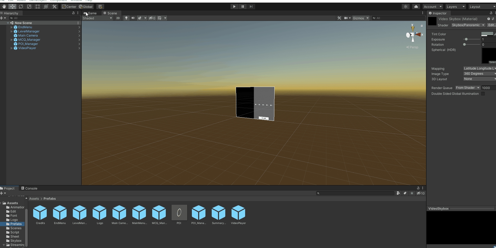
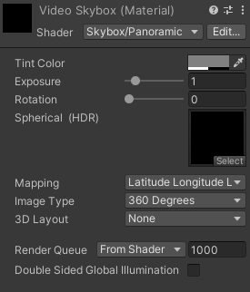
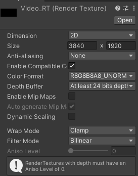
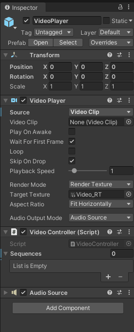
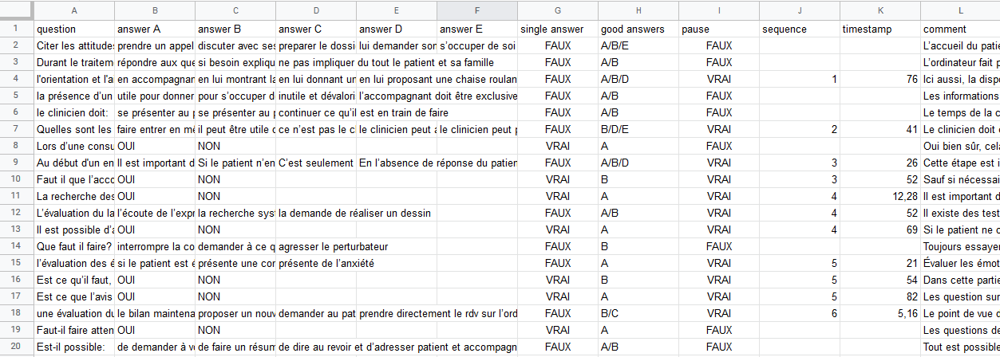
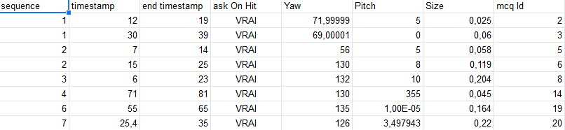
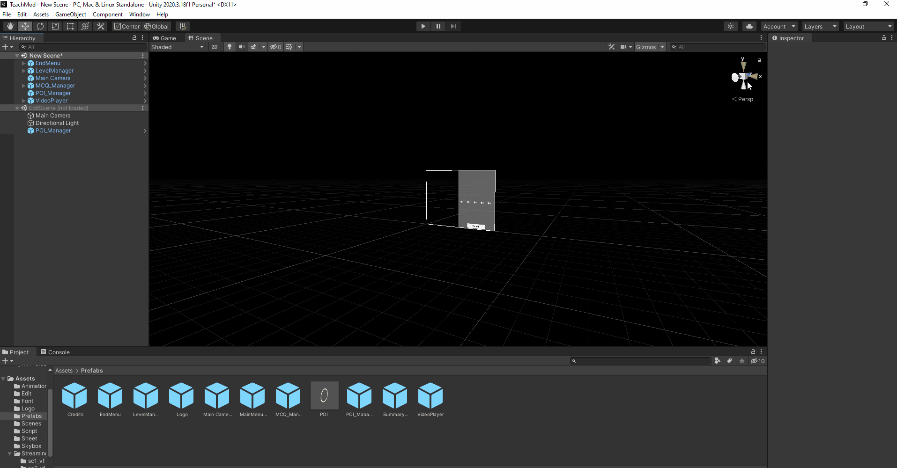
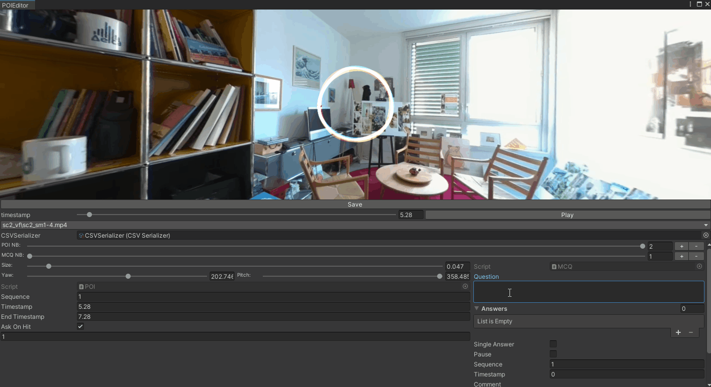

# Manuel Utilisateur

Ce Manuel est conçue pour vous aider à apprendre à utiliser TeachMod. Ce Manuel vous apprendra deux choses:

- Expliquer les différentes fonctionnalités en profondeur
- Expliquer comment concevoir votre propre TeachMod avec celle-ci

Ainsi, ce manuel sera présenter dans l'ordre de qu'il faut suivre pour créer votre propre TeachMod, et expliquera les différentes fonctionnalités quand elle apparaîtront.

___

## Table des Matières

- [Manuel Utilisateur](#manuel-utilisateur)
	- [Table des Matières](#table-des-matières)
	- [Pour Commencer](#pour-commencer)
	- [Créer une Scene](#créer-une-scene)
	- [VideoController](#videocontroller)
	- [CSVSerialiser](#csvserialiser)
	- [Editeur de Spreadsheet](#editeur-de-spreadsheet)
	- [CSV Editor](#csv-editor)
		- [_lecteur de vidéo à 360°_](#lecteur-de-vidéo-à-360)
		- [_CSV Editor_](#csv-editor-1)
	- [Pour Finir](#pour-finir)

___

## Pour Commencer

Vous allez avoir besoin d'une verion de Unity.2020.3, et d'ouvrir le projet TeachMod.

___

## Créer une Scene

Premièrement, pour créer votre propre application, vous allez devoir créer une nouvelle scène and placer tout les prefabs nécessaire comme vous pouvez le voir ci-dessous:



Les objets nécessaire pour faire fonctionner votre scène:

- Un End Menu
- Un Level Manager
- Un Main Camera
- Un MCQ_Manager
- Un POI_Manager
- Un VideoPlayer

Finissons de mettre la scène en place. Voir ci-dessous:



Il nous faut changer le Material de la Skybox pour la VideoSkybox dans le dossier SkyBox/. Il y a deux façon de le faire:

- Drag-and-Drop le Material dans la scène sur la Skybox (un endroit vide)
- Allez dans Window->Rendering->Lighting->Environment et remplacez le materialde la skybox

Votre scène peut maintenant afficher des vidéos panoramique.

<br>
<details>
<summary>Par rapport à l'affichage de la vidéo...</summary>
<p>

Vous voudrez peut-être changer la résolution et la façon dont la vidéo est affiché/le type de vidéo.
Vou n'aurez qu'à changer les option du material et de la render texture:

<p align="middle">
	
	 
</p>

Vous pourrez changer le type de  vidéo (360° or 180°) et sa résolution notamment.

</p>
</details>

</br>

Mais pour afficher des vidéos panoramique, nous devons  dire lesquels l'applicatioon doit afficher.

___

## VideoController

Le VideoController est un script relier au Video Player et qui aide à lire les vidéos. Voilà comment en mettre en place un:

<p align="middle">
	
</p>

Il vous faut mettre toute les vidéos que vou voulez afficher sur la Skybox dans les "Sequences" (le chemin complet partant du dossier Assets jusqu'au fichier vidéos avec son extensions). Toutes sequences sont séparés par un fondue au noir enchainée, Vous voudrez peut-être faire du montage vidéo si vous voulez évitez cet effet.

Généralement, tout les types de vidéos que Unity supporte est supporté par ce script. Cependant...


<span style="color:red"> ___/!\ Tout fichier vidéos devrait être contenu dans le dossier Streaming Assets/, Autrement les vidéos ne seront pas retrouvé lorsque l'application sera compilé /!\ .___ </span>

Lorsqu'une sequence se termine, il va à la prochaine. Lorsqu'il n'en reste plus à afficher, l'application considère qu'elle est terminée et elle affiche les questions non répondues (s'il y'en a) puis le récapitulatif et les crédits.

Nous devons maintenant rajouter nos objets interactif (les POI) et nos questions au vidéos...

___

## CSVSerialiser

Pour cela nous utiliserons un CSVSerialiser. C'est un Assets spécial qui charge les fichier csv représentant nos interactions. Ci-dessous la façon d'en créer un et de la rajouter à la scène:


Créer votre propre CSVSerializer et rentrer vos propres chemins vers vos fichiers csv (le chemin complet depuis le dossier Streaming Assets/ avec l'extension du fichier), puis donnez-le au POI_Manager.  

<span style="color:red"> ___/!\ Tout fichier csv devrait être contenu dans le dossier Streaming Assets/, Autrement les fichier ne seront pas retrouvé lorsque l'application sera compilé /!\ .___ </span>

<br>
<details>
<summary>À propos des POI...</summary>
<p>

Comme montrer au dessus, le design des POI est un prefabs ; vous pouvez créer le votre si le désire vous prends.

Il n'aura besoin que d'un collider et du script POI.

</p>
</details>
</br>

Nous avons désormais un CSVSerializer mais nos fichiers csv sont vide donc l'application ne fera rien, pour les remplir vous pouvez:

- le remplir à partir d'un editeur de spreadsheet
- le remplir à partir du CSVEditor

___

## Editeur de Spreadsheet

Ouvrir un fichier csv de mcq (QCM) dans un editeur de spreadsheet ressemblera à cela:



Ci-dessous des explications sur coment le remplir:

Nom |question| answer A to E| single answer | good answers | pause | sequence | timestamp | comment
|:---:|:---:|:---:|:---:|:---:|:---:|:---:|:---:|:---:|
|Explications | la question posé | les différentes réponses que l'utilisateur peut choisir | Est-ce que l'utilisateur ne peut choisir qu'une seule réponse? | Quelles réponses sont les bonnes réponses | Est-ce que la vidéo se met en pause pour poser la question à l'utilisateur? | À quelle vidéo la question est associée | À quel timestamp la question est posé si elle l'est | commentaire pour expliquer les réponses
| Comment le remplir | un texte (peut être sur plusieurs lignes) | un texte (peut être sur plusieurs lignes) ou vide si il n'y en a pas | VRAI ou FAUX | La lettre de la réponse séparé par / s'il y'en a plusieurs  | VRAI ou FAUX | un nombre entier | un nombre réel | un texte (peut être sur plusieurs lignes)
Notes additionnelles|||attention, si la case n'est pas complétement vide, la réponse sera quand même considéré comme une réponse valide.

Ouvrir un fichier csv de POI dans un editeur de spreadsheet ressemblera à cela:



Nom | sequence |timestamp| end timestamp | ask On Hit| Yaw | Pitch | Size | mcq Id
|:---:|:---:|:---:|:---:|:---:|:---:|:---:|:---:|:---:|
|Explications | À quelle séquence le POI devrait apparaître? | À quel timestamp de cette vidéo? | Quand il devrait disparaître? | Est-ce qu'il pose la question associé immediatement? | la rotation autour de l'axe Y | la rotation autour de l'axe X | la taille du POI | l'ID de la question associé
| Comment le remplir | un nombre entier | un nombre réel | un nombre réel | VRAI ou FAUX | un nombre réel | un nombre réel | un nombre réel | le chiffre de la ligne de la mcq sur l'autre spreadsheet
Extra Notes||||| la rotation représente celle de la caméra pour voir le POI| Ainsi cela change la position et non pas la rotation du POI

<span style="color:red"> ___/!\ Soyez prudent par rapport à l'encodage: l'encodage doit-être l'UTF8. Vérifiez que votre editeur le supporte avant de faire des modifications /!\ .___ </span>

___

## CSV Editor

Pour ouvrir l'editeur, regarder dans les fenêtre comme montrer ci-dessous:



L'Editeur se compose de:

- un lecteur de vidéo à 360°
- un éditeur de CSV
  
### _lecteur de vidéo à 360°_

Le lecteur est là pour aider remplir les timestamps:


Vous pouvez choisir un vidéo dans la liste, la jouer, maintenir le bouton gauche de la souris pendant que vous bougez la souris pour bouger la caméra, et choisir le timestamp.

<br>
<details>
<summary>Concernant les vidéos proposées...</summary>
<p>

Pour le moment, l'editeur ne propose que les vidéos sous le format mp4, vous pouvez le changer dans le script [EditVideoPlayer](../Assets/Edit/EditVideoPlayer.cs#L31)

```csharp
		_movieFiles = Directory.GetFiles(Application.streamingAssetsPath, "*.mp4", SearchOption.AllDirectories);
		/* remove the streaming asset path of the file names, and the slash */
		int rmLength = Application.streamingAssetsPath.Length + 1;
		for (int i = 0; i < _movieFiles.Length; i++)
        {
			_movieFiles[i] = _movieFiles[i].Remove(0, rmLength);
        }
```

Il faut changer ces lignes pour inclure vos types de fichiers.

</p>
</details>
</br>

### _CSV Editor_

Vous devez drag-and-drop le CSVSerializer dans le champ dédier puis:


Vous pouvez rajouter et supprimer un POI et un MCQ en cliquant sur les boutons + et -. Choisissez celui que voulez changer en faisant glisser le slider.

Vous pouvez éditer les même champs que dans les editeurs de spreadsheet pour les POI, soit:

- Size avec un slider
- Sequence avec le champ de nombre
- Timestamp et end timestamp avec le champ de nombre
- askOnHit avec une checkbox
- Le mcqID avec un champ de nombre à la fin
- Et la rotation avec des sliders ou en maintenant le bouton droit de la souris et en tournant la caméra

Vous pouvez éditer les même champs que dans les editeurs de spreadsheet pour les MCQ, soit:



- Question, Answers, et Comment dans des zones de textes
- Single Answer et pause avec des checkboxes
- Timestamp avec des nombres
- sequence avec des nombres
- right Answers en écrivant les lettres appropriés dans un tableau

<span style="color:red"> ___/!\ Après avoir éditer vos fichiers n'oubliez pas de le sauvegarder en cliquant sur le bouton "save", car lorsque la fenêtre se ferme tout le travail sera perdu /!\ .___ </span>

Lorsque vous cliquez sur le bouton "save" et que les fichiers n'existent pas, les fichiers seront créer dans le processus.

___

## Pour Finir

Maintenant vous devrez pouvoir utilisez l'application.
Vous pouvez éventuellement créer une nouvelle scène pour le menu principal et non pas l'original. Dans ce cas, il vous faudra rajouter le Level Manager et modifier le prefabs "Main Menu".

Merci d'avoir lu, en espérant que cela vous aura aidé.
