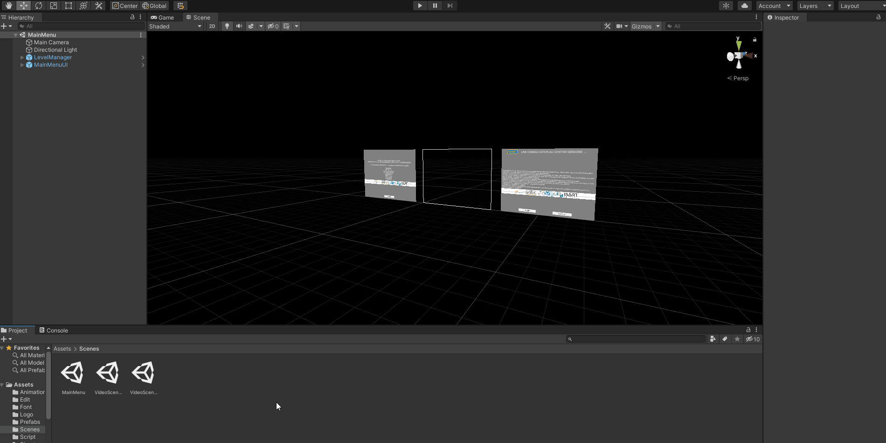
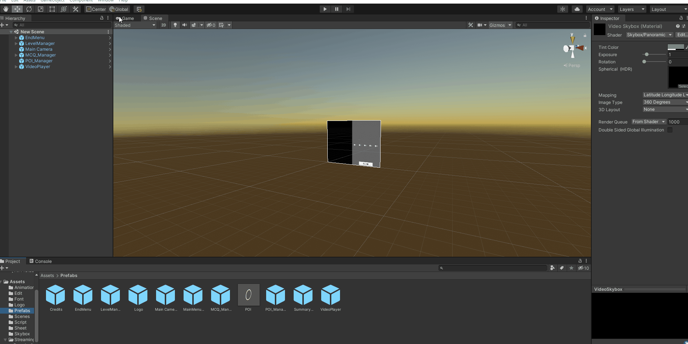
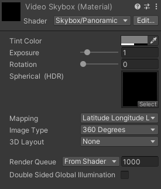
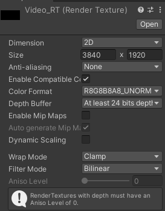
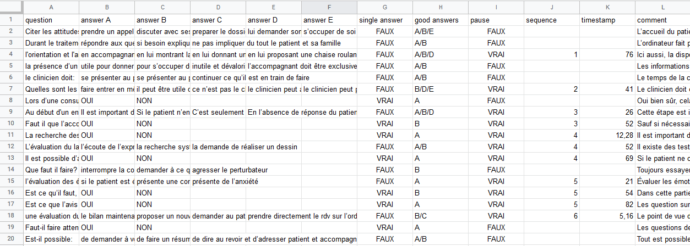
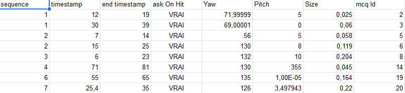

# User Manual

This User Manual will help you learn how to use teachmod. It has two purposes:

- Explain the different features in more depth
- Explain how to create your own teachmod

Therefore, this User Manual will be presented in order of what to do to create your own teachmod app, and will explain the diffrent features in depth when they are important.
___

## Table of Content

- [User Manual](#user-manual)
	- [Table of Content](#table-of-content)
	- [To Begin](#to-begin)
	- [Creating a Scene](#creating-a-scene)
	- [VideoController](#videocontroller)
	- [CSVSerialiser](#csvserialiser)
	- [SpreadSheet Editor](#spreadsheet-editor)
	- [CSV Editor](#csv-editor)
		- [_360° Video Player_](#360-video-player)
		- [_CSV Editor_](#csv-editor-1)
	- [To Close](#to-close)

___

## To Begin

You will need to download a version of Unity.2020.3, then open the TeachMod project.

___

## Creating a Scene

Firsr of, to create your own module you need to create a new Scene and put all the prefabs you need in it as shown below



The objects needed to make your Scene work are:

- An End Menu
- A Level Manager
- A Main Camera
- A MCQ_Manager
- A POI_Manager
- A VideoPlayer

You will have an explation of what each prefabs does. but before that we shall finish to setup the Scene. See Below:



You will need to change the Skybox Material to the VideoSkybox in the SkyBox/ Folder. There is two way to do it:

- Drag and Drop the material inside the Scene on the Skybox (an empty space)
- go in the rendering->lighting->environment settings and replace the skybox material

Your Scene will then be able to display a panoramic video.

<details>
<summary>On Video Display...</summary>
<p>

You may change the resolution and the way the video is displayed/The type of video
You just have to change the option of the material and render texture:

<p align="middle">
	
	 
</p>

You will be able to change the Video Type (360° or 180°) and the Video Resolution.

</p>
</details>

But to display a panoramic video it needs to know which one it should display.

___

## VideoController

The video controller is a script that is bound to the Video Player and help play video. Here how you may set one up:

<p align="middle">
	
</p>

You should put all videos that you want to be played on the Skybox in the sequences (the full path with the Assets File being the Root and with the video file type at the end of it) ; know that all sequences are separated to a crossfade to black, so you may want to do some editing if you want to avoid this effect.

Generally all video types that Unity support is supported by this script but...

<span style="color:red"> ___/!\ All video files should be stored in the Streaming Assets/ File, otherwise when building the application the video will not be found /!\ .___ </span>

When a Sequence is finished, it goes to the next one, then when all have been displayed it is considered the end of the test and the question not answered (if there are some) and the recap is shown (then the credits).

Then you need to bound your interactive objects (that we will call POI) and questions to the videos...

___

## CSVSerialiser

For that you should use a CSVSerialiser, it a special assets that load and save csv files that represent our interactions, here how to create one and bound it to the scene:


Create your own CSVSerializer put your CSV Files path for the POI and questionnaire (the full path with Streaming Assets/ being the root), then give it to the poi manager.  

<span style="color:red"> ___/!\ All csv files should be stored in the Streaming Assets/ File, otherwise when building the application the files will not be found /!\ .___ </span>

<details>
<summary>On POI...</summary>
<p>

As shown above, the design for the POI is a prefabs ; you can create your own design if you want to.

It will just need a collider and the POI script assigned to it.

</p>
</details>

we have a csv serializer but for now, the csv files are empty so it will not do anything, to fill it you have two choices:

- open it in a spreadsheet editor
- open it in the csv editor

___

## SpreadSheet Editor

Opening a mcq csv file in spreadsheet editor will look like this:



You should fill the spreadsheet this way:

Name |question| answer A to E| single answer | good answers | pause | sequence | timestamp | comment
|:---:|:---:|:---:|:---:|:---:|:---:|:---:|:---:|:---:|
|Explanation |The question asked| the different answers that the user can choose | can user only choose one answer? | which answer are the good answers | does the video pauses to ask the question to user? | which video the question is about | what timestamp in this video | comment shown after the user has answered to elaborate
| how should it be filled | a text (can be on multiple line) | a text (can be on multiple line) or empty if there is none | TRUE or FALSE | the letter of the answer separated by / if there are several  | TRUE or FALSE | a natural number | a real number | a text (can be on multiple line)
Extra Notes|||(be careful, if it is not completely empty, it will still show like a viable answer in the application)

Opening a poi csv file in spreadsheet editor will look like this:



Name | sequence |timestamp| end timestamp | ask On Hit| Yaw | Pitch | Size | mcq Id
|:---:|:---:|:---:|:---:|:---:|:---:|:---:|:---:|:---:|
|Explanation | which video the poi will appear | what timestamp in this video | when should it disappear | asks the question associated when interacted with? | the rotation around the y axis | the rotation around the x axis | the question associated with
| how should it be filled | a natural number | a real number | a real number | TRUE or FALSE | a real number | a real number | a real number | the id of the mcq in the other spreadsheet
Extra Notes||||| the rotation represent the one of the camera to see the POI|therefore it changes the position not the rotation of the POI

<span style="color:red"> ___/!\ Be really careful about encoding: it should be UTF8 encoding. Look if your editor supports it before doing any changes and saving it /!\ .___ </span>

___

## CSV Editor

To open Editor look at the windows as you can see below:


The Editor has two things inside of it:

- A 360° Video Player
- A CSV Editor
  
### _360° Video Player_

The video player is to help choosing the timestamp:


You can choose a video in the list, then play it, hold left mouse button while moving the mouse to move the camera, and move the timestamp.

<details>
<summary>Concerning the videos shown...</summary>
<p>

As of right now, the editor only proposes mp4 as video files you can play in the video player it can be changed in the [EditVideoPlayer](../Assets/Edit/EditVideoPlayer.cs#L31) Script

```csharp
		_movieFiles = Directory.GetFiles(Application.streamingAssetsPath, "*.mp4", SearchOption.AllDirectories);
		/* remove the streaming asset path of the file names, and the slash */
		int rmLength = Application.streamingAssetsPath.Length + 1;
		for (int i = 0; i < _movieFiles.Length; i++)
        {
			_movieFiles[i] = _movieFiles[i].Remove(0, rmLength);
        }
```

You should change those lines to include your video formats.

</p>
</details>

### _CSV Editor_

You need to drag and drop the csv serializer in the field for it then:


You can add or remove a POI or a MCQ by clicking on the + or - buttons, the choose the one you edit by draging the slider.

With the POI Editor you can Edit the same field than in the spreadsheet:

- Size with slider
- Sequence with number
- Timestamp and end timestamp with number
- askOnHit with a checkbox
- the mcqID with the number at the end
- and rotation with sliders or doing right click and rotating with the camera
  
With the MCQ Editor you can Edit the same field than in the spreadsheet:


- Question, Answers, and Comment in text field
- Single Answer and pause in checkboxes
- Timestamp with number
- sequence with a number
- right Answers by writing Letter in an array

<span style="color:red"> ___/!\ After having editing your file do not forget to save it by clicking the save button, as when the window closes all work is lost /!\ .___ </span>

If you click on save when the files do not exist, they are created in the process.

___

## To Close

Now, you should be ready to use your application.
Eventually create a new scene for a main menu if you do not want to use the original one, in that case I advise you to use the Level Manager and change the Main Menu UI rather than making it from nothing.

Thank you for reading until the end and I hope it helped you.
