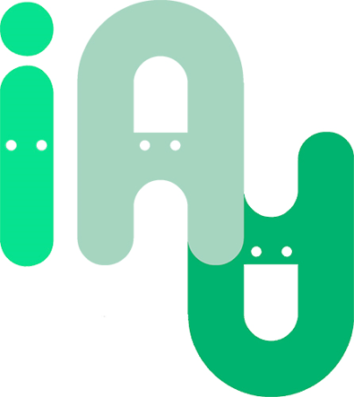
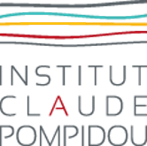

# _TeachMod_

Un projet du Cobtek Lab consistant à tester les étudiants dans leurs capacités à discerner ce qu'il faut faire et ne pas faire lors d'un entretien clinique.

Le projet sera supporter sur tous les appareils cité ci-dessous:

- Windows
- Android
- IOS
- MacOs

L'application consiste en une vidéo panoramique (à 360°) interactive, dans laquel des cercles et des questions apparaissent devant l'utilisateur pour tester ses aptitudes et connaissances des entretiens cliniques.

## Auteur

Cette applcation a été dévelopé dans l'optique d'un stage avec le Cobtek Lab avec l'aide de (par ordre alphabétique):

	
	 
	
	
	
	
	

Name  | Contribution
:---: | :---:
Quentin Bleuse | Développeur
Philippe Robert| Maître de stage et Psychiatre
Maël Addoum| Maître de stage
Alexandre Derreumaux| Technicien
Rachid Guerchouche| Technicien
Paul Galindo| Consultant

Aussi un grand merci à ceux ayant joué dans les vidéos:

- Nadia Bilger
- Julie Brousse
- Alexandre Derreumaux
- Valeria Manera
- Magalie Templier
- Marilou Serris

Les vidéos ne sont pas disponible sur ce répertoire pour des raisons évidente de droit à l'image. Elles peuvent être vus par l'intermédiaire de l'application disponible à ce lien:

[Not currently Up]()

___

## Table des matières

- [_TeachMod_](#teachmod)
	- [Auteur](#auteur)
	- [Table des matières](#table-des-matières)
	- [Technologies](#technologies)
	- [Inspiration](#inspiration)
	- [Pour Compiler](#pour-compiler)
	- [Pour Lancer](#pour-lancer)
	- [Fonctionnalités](#fonctionnalités)
	- [Manuel Utilisateur](#manuel-utilisateur)
	- [Notes Additionnels](#notes-additionnels)
	- [License](#license)

___

## Technologies

Ce projet a été développé sous Unity (2020.3.12f1) pour deux raisons:

- Unity est le logiciel le plus qui permet le plus simplement d'afficher une vidéo panoramique sur une skybox.
- La version 2020.3.12f1 était la plus récente version proposant un soutien à long terme (LTS) lors de la création du projet.
  
___

## Inspiration

Ci-dessous des liens de site m'ayant inspiré pour certains problèmes rencontré sur le projet:

- [affichage d'une vidéo panoramique sur une skybox](https://learn.unity.com/tutorial/play-360-video-with-a-skybox-in-unity)
- [Fondue au Noir pour passer d'une sequence ou d'un level à un autre](https://www.youtube.com/watch?v=CE9VOZivb3I&t)
- [Le contrôle de la caméra avec un Gyroscope](https://gist.github.com/kormyen/a1e3c144a30fc26393f14f09989f03e1)

___

## Pour Compiler

Vous devriez être capable de Compiler si vous avez la même version de Unity (2020.3) spécifiée au dessus.
You should be able to Build if you have the same version of Unity (2020.3) to the platform stated above.

/!\ Les vidéos ne sont pas disponibles dans le repertoire pour des raisons évidentes de droit à l'image, mais vous pouvez utiliser le système pour créer votre "propre TeachMod"(Je vous conseille de lire le Manuel Utilisateur si c'est le cas)/!\
___

## Pour Lancer

L'application devrait être disponible à ce lien: [Not currently Up]()

Si vous l'avait compilé par vous-même, il devrait être dans le dossier que vous avez indiqué ou disponible sous la forme d'une application sur mobile.
Lancez-la en ouvrant celle-ci.

___

## Fonctionnalités

Voici une Liste non-exhaustive de toute les fonctionnalités présentes dans l'éditeur et l'application:

- ### _L' Affichage d'une vidéo panoramique sur une skybox_
  
  Cela été possible grâce à la solution de Untiy. Je vous conseille de lire le [Manuel Utilisateur]() pour créer une Scène qui foncionne avec le Video Player.

- ### _Caméra Gyroscopique pour mobile, Caméra au clavier pour les utilisateur PC_
  
  Les deux caméras changent en fonction de la plateforme, il est conseillé d'utiliser les prefabs à cet effet pour cette fonctionnalité.
  La fonctionnalité contient notamment un recalibrage pour le gyroscope.

- ### _Un Sérialiseur en CSV, permettant à l'utilisateur de changer les données hors de Unity_
  
  Toutes les sauvegardes sont faites dans des fichier csv encodées en UTF-8, qui doivent impérativement se trouver dans le dossier Streaming Assets/.
  Vous pouvez utiliser des applications de spreadsheet (comme Excel) pour modifier les fichier en dehors de Unity, mais il est nécessaire que l'Encodage sois le même, sinon quoi les fichiers risque d'être corrompu. Veillez référer au [Manuel Utilisateur]() pour de plus amples explications.

- ### _Un Éditeur de CSV, Créer pour simplifier l'entré des données_
  
  Celui-ci contient un lecteur de Vidéo à 360° pour savoir les timestamp de vos vidéos, et un éditeur pour rentrer les informations des questions et moments interactifs de vos vidéos. Veillez référer au [Manuel Utilisateur]() pour de plus amples explications.

  /!\ Pour le moment, seul des vidéos au format mp4 peuvent être lus par le lecteur intégrer /!\
  
___

## Manuel Utilisateur

Le Manuel Utilisateur est disponible dans le fichier [ManuelUtilisateur.md](Documentation/ManuelUtilisateur.md).

___

## Notes Additionnels

- Dans le Package, le package post process est inclus sans pour autant que nous ne l'utilisions (nous l'vons utilisés auparavent). Vous pouvez le désinstaller si vous voulez.
- Tous les fichiers bruts tels que les fichiers mp4 ou csv doivent être contenus dans le dossier Streaming Assets, sans quoi il ne seront pas importés lors de la compilation.

## License

Voyez le fichiers [LICENSE.md](LICENSE.md) Pour les droits et limitation de la license (GPLv3).
